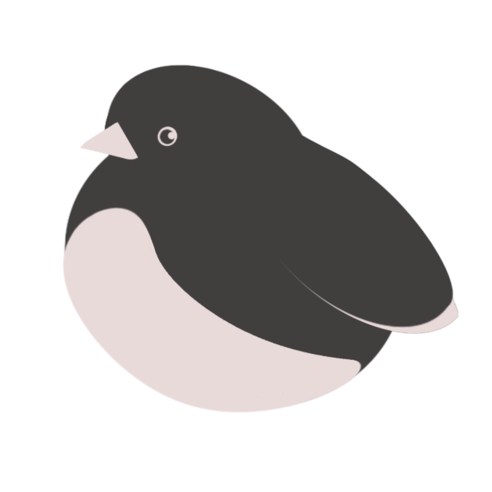
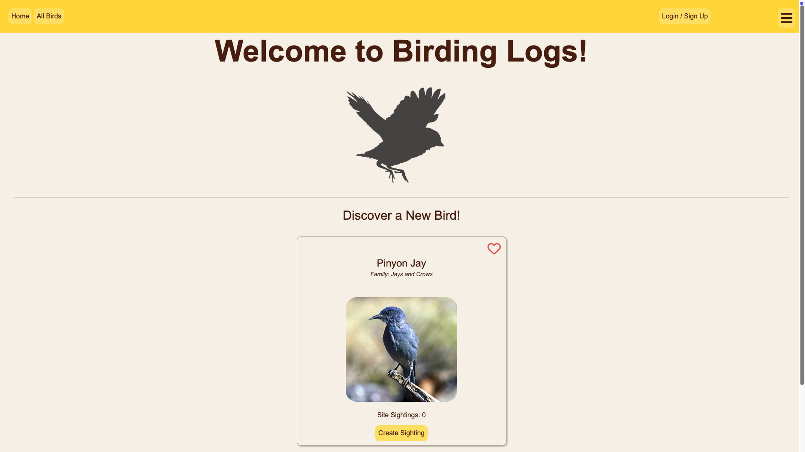

<a id="readme-top"></a>
<br />
<div align="center">
    
  </a>

  <h1 align="center">Birding Logs</h2>

  <p align="center">
    A full stack web application created for bird enthusiasts!
    <p align="right"><i>Last Updated April 20th, 2025</i></p>
    <p align="right">Deployment Coming Soon!</p>

</div>

<details>
  <summary>Table of Contents :owl: </summary>
  <ol>
    <li>
      <a href="#about-birding-logs">About Birding Logs</a>
      <ul>
        <li><a href="#built-with">Built With</a></li>
      </ul>
    </li>
    <li>
      <a href="#getting-started">Getting Started</a>
      <ul>
        <li><a href="#prerequisites">Prerequisites</a></li>
        <li><a href="#setup">Setup</a></li>
        <li><a href="#trouble-shooting">Trouble Shooting</a></li>
      </ul>
    </li>
    <li><a href="#usage">Usage</a></li>
    <li><a href="#roadmap">Roadmap</a></li>
    <li><a href="#contact">Contact</a></li>
    <li><a href="#acknowledgements">Acknowledgements</a></li>
  </ol>
</details>


## About Birding Logs


<p>To be added later</p>

<p align="right"><a href="#readme-top">:dove: back to top</a></p>

### Built with
[![React][React.js]][React-url]

[![Tailwind-CSS][Tailwind-CSS]][Tailwind-url]

[![Docker][DOCKER]][Docker-url]

[![FastAPI][FastAPI]][FastAPI-url]

[![PostgreSQL][PostgreSQL]][Postgres-url]

[![nginx][nginx]][nginx-url]


## Getting Started

### Prerequisites
You will need:
- docker
- a clone of this repository
- some command line knowledge
<p align="right"><a href="#readme-top">:whale: back to top</a></p>

### Setup
 1. Please clone this repository onto your local machine

 2. Create a ```.env``` file in **/birdinglogs** directory. In this file you will need to declare **6 variables**:
    ```
    SIGNING_KEY=<letters or numbers (length 20-40)>
    POSTGRES_USER=<postgres username>
    POSTGRES_PASSWORD=<postgres password>
    POSTGRES_DB=<postgres database>
    SECRET_KEY=<generate a sha-256 hash value>
    ALGORITHM=HS256
    ```

    Example:
    ```
    SIGNING_KEY=XT71ZDOLST1B9N3GZ0PD6YJT0
    POSTGRES_USER=test_user
    POSTGRES_PASSWORD=password
    POSTGRES_DB=test_database
    SECRET_KEY=09d25e094faa6ca2556c818166b7a9563b93f7099f6f0f4caa6cf63b88e8d3e7
    ALGORITHM=HS256

    ```
    Note: To get a sha-256 value on you computer, run ```openssl rand -hex 32``` in your console.

 3. On your command line go back into the **/birdinglogs** repo directory and use these commands:
    -   ```docker compose -f 'docker-compose-prod.yml' up --build -d```
    -   Go to your http://localhost:80/ to see the website (may take a few minutes to appear while docker builds the database)! I highly recommend viewing this application on Google Chrome.
    -   When you are done, run ```docker compose -f 'docker-compose-prod.yml' down && docker volume remove birdinglogs_bird-data``` to remove all the containers and volumes.
 4. Enjoy!
<p align="right"><a href="#readme-top">:whale2: back to top</a></p>

### Trouble Shooting
Comming Soon

<p align="right"><a href="#readme-top">:whale: back to top</a></p>

## Usage

An educational app to help bird lovers track birds and encourage interaction and acknowledgment of the local nature around them.

This application also shows my software development skills.
<p align="right"><a href="#readme-top">:bird: back to top</a></p>

<!-- ROADMAP -->
## Roadmap
- [x] Interactive Bird Catalogue
- [x] User Authentication
- [x] Note Taking Feature
- [x] Update Authentication
- [ ] Deployment
- [ ] Bird Feeder Tracking
- [ ] TBD
<p align="right"><a href="#readme-top">:car: back to top</a></p>

## Contact

This application was developed independently, and I would appreciate any feedback. You can find me on Linkedin:
https://www.linkedin.com/in/maddy-foley/
<p align="right"><a href="#readme-top">:baby_chick: back to top</a></p>

## Acknowledgements
- [Wikipedia](https://www.wikipedia.org/) to scrape bird data
- [README Template](https://github.com/othneildrew/Best-README-Template)
- [GitHub Emoji Cheat Sheet](https://www.webpagefx.com/tools/emoji-cheat-sheet)
- [Img Shields](https://shields.io)
- [Font Awesome](https://fontawesome.com/)
- More resources to come with changes!
<p align="right"><a href="#readme-top">:hatched_chick: back to top</a></p>


<!-- variables -->

[React.js]: https://img.shields.io/badge/React-20232A?style=for-the-badge&logo=react&logoColor=61DAFB
[React-url]: https://reactjs.org/
[FastAPI]: https://img.shields.io/badge/FastAPI-005571?style=for-the-badge&logo=fastapi
[FastAPI-url]: https://fastapi.tiangolo.com/
[PostgreSQL]: https://img.shields.io/badge/postgresql-4169e1?style=for-the-badge&logo=postgresql&logoColor=white
[Postgres-url]: https://www.postgresql.org/
[DOCKER]: https://img.shields.io/badge/docker-257bd6?style=for-the-badge&logo=docker&logoColor=white
[Docker-url]: https://www.docker.com/
[Tailwind-CSS]: https://img.shields.io/badge/Tailwind_CSS-grey?style=for-the-badge&logo=tailwind-css&logoColor=38B2AC
[Tailwind-url]: https://tailwindcss.com/
[nginx]: https://img.shields.io/badge/Nginx-009639?logo=nginx&logoColor=white&style=for-the-badge
[nginx-url]: https://nginx.org/
